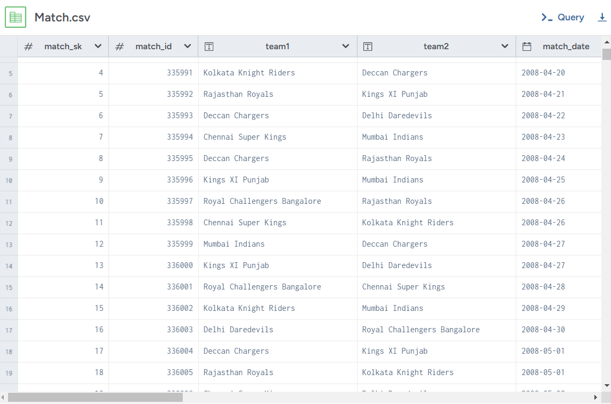
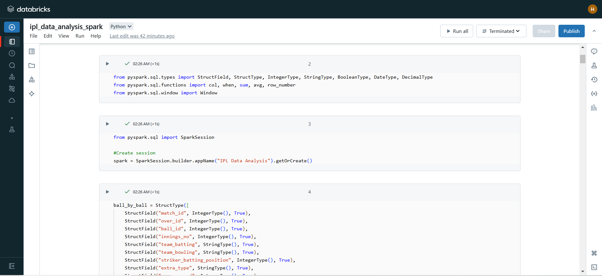
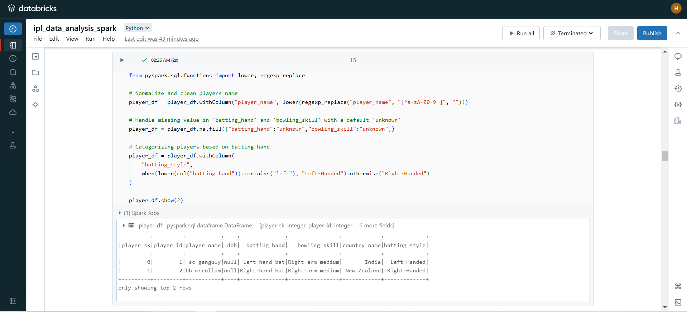

# IPL analysis using PySpark
IPL DATA ANALYSIS USING APACHE SPARK AND AMAZON S3 ON DATABRICKS

### Overview:
In the IPL Data Analysis Project, we delve into multiple datasets encompassing **ball-by-ball action**, **match summaries**, **player profiles**, and **team details** to extract meaningful insights into the sport's competitive landscape.
By employing advanced analytical techniques, the project aims to decode trends in player performances, predict match results, and formulate strategic recommendations for teams.
This comprehensive analysis not only highlights key performers and pivotal match moments but also contributes to a deeper understanding of tactical decisions that could potentially redefine future IPL seasons.

### Architecture

1. Data Storage: The workflow begins with the Indian Premier League data, which is stored in Amazon S3, a scalable cloud storage service. This provides a robust platform for storing vast amounts of IPL data efficiently.
2. Transformation with Apache Spark: The data from S3 is then processed using Apache Spark, an open-source unified analytics engine. Spark facilitates complex data transformations and analyses, which is essential for handling large datasets like those generated by IPL matches.
3. SQL Analytics and Visualization: After transformation, the data is managed using SQL analytics for structured querying and data manipulation. This step is crucial for preparing the data for meaningful analysis and reporting.
4. Databricks: The entire process is orchestrated using Databricks, a platform based on Apache Spark that provides cloud-based big data processing. Databricks integrates with Apache Spark, Amazon S3, and other tools to streamline workflows from data ingestion and processing to analytics and visualization.

### Technology Used
* Amazon S3
* Apache Spark
* Databricks

### Dataset Preview
1. Original dataset link - https://data.world/raghu543/ipl-data-till-2017
2. Dataset dictionary - https://data.world/raghu543/ipl-data-till-2017/workspace/data-dictionary

### Databricks Interface

### Conclusion
This analysis has provided valuable insights into the performance dynamics of IPL teams across various seasons. 

The Spark DataFrame is utilized to perform analysis on IPL data, focusing on various metrics to extract insights into player performances, team statistics, and match outcomes. This DataFrame, built on a distributed system, allows handling of large volumes of match data efficiently, leveraging Spark's capability to process data across multiple nodes.

### Script for the project
[PySpark Code](ipl_data_analysis_spark.ipynb)
